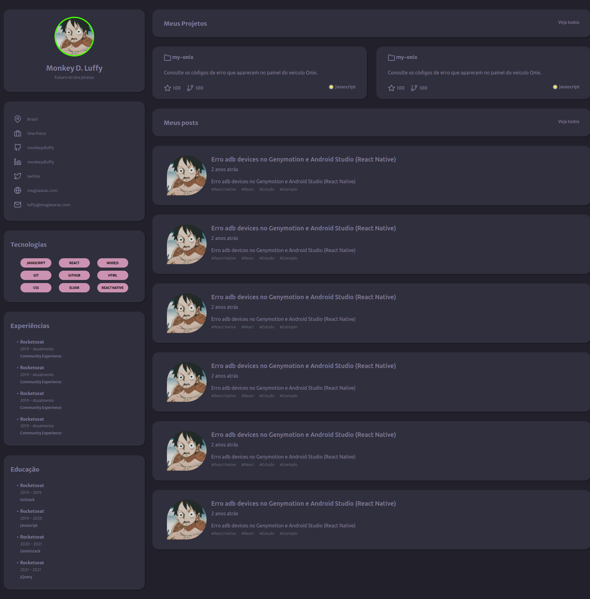

## RockeatSeat Desafio: Portifolio

> Objetivo: Realizar o desenvolvimento do desafio de portifolio da plataforma rockeat seat.

### Sobre o desafio

> Desenvolver uma página web para que seja seu portfolio e currículo. Utilizando HTML e CSS.

### Requisitos

- GitHub;
- HTML;
- CSS;
- BOOTSTRAP;

### Trilha

- Discover
  - O guia estelar do HTML.
  - O guia estelar do CSS.
  - Posicionando foguetes.
  - Formulários de outro planeta.
  - Alinhando os planetas.
  - App bonito, até nos textos

### Outras informações.

- [Site da rockeat seat.](https://app.rocketseat.com.br/discover/challenges/portfolio)
- [Notion da rockeat seat](https://efficient-sloth-d85.notion.site/Desafio-Portfolio-1d3db21e654941f5872aece5fcc6bcc6#70a7b43bedd04d8a930405b3958ba0f1)

### Resultado

- Captura de tela desktop: [Clique aqui](./docs/desktop-print-tela-inteira.png)
- Captura de tela mobile: [Clique aqui](./docs/mobile-print-tela-inteira.png)

> Captura de tela inteira desktop.

